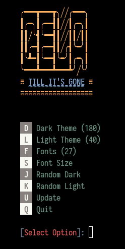

<h2 align='center'> :unicorn: GELACRITTY :unicorn: </h1>
<h3 align='center'> :jack_o_lantern: Set light/dark themes & fonts in Alacritty :christmas_tree: </h1>

 
<strong> :sparkle: There's 200+ themes! :sparkle: </strong>

### Installation :rainbow:

    git clone https://github.com/zim0369/gelacritty $HOME/gelacritty

cd into the cloned directory:

    cd $HOME/gelacritty

Run the installer:

    sh install

All done! :heavy\_check\_mark:

Now use command `gela`

### Uninstall :broken\_heart:

    cd $HOME/gelacritty
    ./uninstall

### Tip :spiral\_notepad:

Help: `gela h`

Dark: `gela d`

Light: `gela l`

Example Mapping in alacritty.conf to toggle light and dark colorscheme:
`- { key: C, mods: Alt, command: {program: "gela", args: ["t"]}}`

*Currently applied theme can be seen under the help menu*

BTW, Doesn't work on WINDOWS
