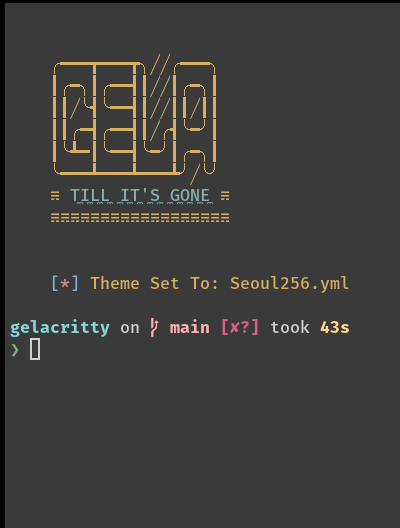
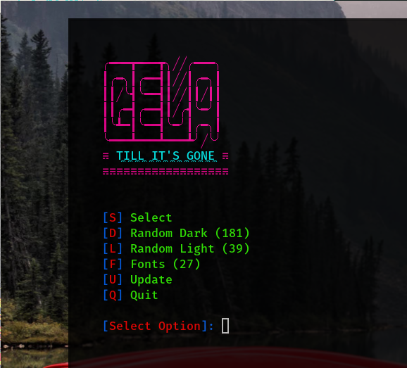
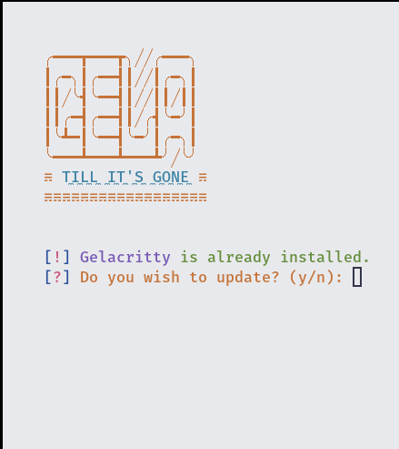

<h2 align='center'> :unicorn: GELACRITTY :unicorn: </h1>
<h3 align='center'> :jack_o_lantern: Set light/dark themes & fonts in Alacritty :christmas_tree: </h1>

<p align='center'>



<strong> :sparkle: There's 200+ themes! :sparkle: </strong>
</p>

### Installation :rainbow:

```
git clone https://github.com/zim0369/gelacritty $HOME/gelacritty
```
cd into the cloned directory:
```
cd $HOME/gelacritty
```
Make the script executable:
```
chmod +x *
```
Run the installer:
```
./install
```
All done! :heavy_check_mark:

Now use command `gela`

### Uninstall :broken_heart:
```
cd $HOME/gelacritty
./uninstall
```

### Tip :spiral_notepad:

For quickly switching theme:

Dark: `-d`

Light: `-l`

BTW, Doesn't work on WINDOWS

### Credits :hugs:

stewie410: https://www.reddit.com/user/stewie410/ 

Aditya Shakya: https://github.com/adi1090x 

Rajasegar: https://github.com/rajasegar
